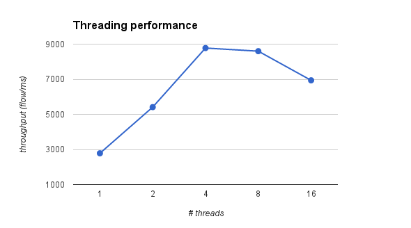

# Benchmarks

The tests below are not meant to be precise, but rather to show that 
**libfluid** performs slightly better or at least as well as existing OpenFlow 
controllers in extremely simple (and probably unfair) scenarios.

We benchmarked some existing controllers and two variations of [example 
libfluid controllers](md_examples_controller_README.html):
* **msg**: uses **libfluid_base** as the backend, and **libfluid_msg** to build
and parse messages
* **raw**: uses **libfluid_base** as the backend, and builds and parses 
messages directly in C.

The benchmarks were performed on a desktop equipped with an Intel Core i7-2600 
CPU (4 cores, 8 threads @ 3.4 GHz) with 8 GB of RAM (@1333 MHz) running Ubuntu 
12.04.2 and its standard software stack. TCMalloc was used for better 
performance in C/C++, and recommended benchmarking guidelines were used when 
available. OpenJDK 7 64-bit provides the JDK/JRE for the Java controllers.

[cbench](http://www.openflowhub.org/display/floodlightcontroller/Cbench) is 
used to take the measurements.

## Test 1: Controller throughput
**Description**: This test shows a raw measurement of the throughput in 
different controllers and compares them to **libfluid**. These values show just 
part of the picture, since there are differences in the implementation of the 
learning switch in different controllers.

**Switches**: 16

**Controllers**: Beacon, NOX MT, Floodlight, raw, msg

**Threads**: 8

**Application**: learning switch

**Command**: `cbench -c localhost -p 6653 -m 10000 -l 16 -s 16 -M 1000000 -t`

**Results (higher is better)**:
Controller | flows/ms
---------- | ----------
raw        | 7929.39
Beacon     | 7682.54
msg        | 5013.35
Floodlight | 2490.61
NOX MT     | 2310.17

**Comments**: the **msg** controller doesn't perform as well as the **raw**
controller due to C++ object creation. The performance gap could be practically 
eliminated by using an object pool. Java doesn't seem to be affected by this 
problem as much, helping Beacon's great numbers.

## Test 2: Controller latency
**Description**: This test shows a comparison of the latencies introduced by 
different controllers running a learning switch application and compares them 
to **libfluid**. These values show just part of the picture, since there are 
differences in the implementation of the learning switch in different 
controllers.

**Switches**: 16

**Controllers**: Beacon, NOX MT, Floodlight, raw, msg

**Threads**: 8

**Application**: learning switch

**Command**: `cbench -c localhost -p 6653 -m 10000 -l 16 -s 16 -M 1000000`

**Results (lower is better)**:
Controller | ms
---------- | ----------
Floodlight | 0.005233
msg        | 0.005213
raw        | 0.005178
Beacon     | 0.004978
NOX MT     | 0.004576

**Comments**: we didn't optimize **libfluid** for latency at any time during
development. It may be possible to improve these numbers.

> Tests 3 and 4 only measure **libfluid_base** (using the **raw** controller).

## Test 3: Threading performance
**Description**: This test made to see how **libfluid** performance varies 
depending on the number of threads. In this test we use a different 
application, which simply replies to cbench's packet in events with dummy flow 
mods, so we can test how **libfluid_base** performs when tuning the number of 
threads used. We will call this application "cbench fast reply".

**Switches**: 16

**Controllers**: raw

**Threads**: 1, 2, 4, 6, 8, 16

**Application**: cbench fast reply application (see description)

**Command**: `cbench -c localhost -p 6653 -m 10000 -l 16 -s 16 -M 1000000 -t`

**Results (higher is better)**:
Threads    | flows/ms
---------- | ----------
1          | 2781.02
2          | 5411.45
4          | 8777.26
8          | 8599.53
16         | 6937.99

**Comments**: due to the simple nature of the cbench fast reply application, 
its performance is better with 4 threads. The learning switch in all the other 
controllers runs faster with 8 threads.

## Test 4: Network size performance
**Description**: This test shows how **libfluid_base** performance scales when 
increasing the network size. The number of MACs per switch was reduced (from 
1000k to 100k) to avoid thrashing.

**Switches**: 1, 4, 16, 64, 256, 1000 (~2^2n, n = 0..5)
    
**Controllers**: raw

**Threads**: 8

**Application**: learning switch

**Command**: `cbench -c localhost -p 6653 -m 10000 -l 16 -s 16 -M 100000 -t`

**Results (higher is better)**:
Switches   | flows/ms
---------- | ----------
1          | 2327.88
4          | 7128.02
16         | 8013.98
64         | 7513.87
256        | 7334.20
1000       | 7386.28

## Benchmarking parameters
**Beacon**

Download the [binary](https://openflow.stanford.edu/static/beacon/releases/1.0.2/beacon-1.0.2-linux_x86_64.tar.gz).
See the [instructions](https://openflow.stanford.edu/display/Beacon/Benchmarking).

**NOX MT**

Download from [GitHub repo](https://github.com/noxrepo/nox/archive/901365930e390f65af027e1bdbd5478824ed0715.zip).

Build with `../configure --enable-ndebug` and run with:
~~~{.sh}
export LD_PRELOAD=/usr/lib/libtcmalloc_minimal.so.0
./nox_core -i ptcp:6653 -t 8 switch
~~~

**Floodlight**

Download the [sources](http://floodlight-download.projectfloodlight.org/files/floodlight-source-0.90.tar.gz).

See the [instructions](http://www.openflowhub.org/display/floodlightcontroller/Benchmarking%2BConfiguration%2B%28New%29/).

Put the following line in `/src/main/resources/floodlightdefault.properties`:
~~~
net.floodlightcontroller.core.FloodlightProvider.workerthreads = 8
~~~
And then build and run:
~~~
$ ant
$ ./floodlight.sh
~~~

**raw**

Build with `-ltcmalloc -O3`

Run with: `./raw_controller [app]`

**msg**

Build with `-ltcmalloc -O3`

Run with: `./msg_controller [app]`

## Raw results

**Test 1**

~~~
Beacon: min/max/avg/stdev = 7647509.28/7707083.74/7682538.55/15944.03 responses/s
NOX MT: min/max/avg/stdev = 2301158.41/2316124.24/2310168.71/4743.04 responses/s
Floodlight: min/max/avg/stdev = 2480042.48/2497046.98/2490607.36/3884.80 responses/s
msg:  min/max/avg/stdev = 4930998.74/5111914.47/5013347.86/42440.88 responses/s
raw: min/max/avg/stdev = 7851036.82/7990869.67/7929393.73/46709.62 responses/s
~~~

**Test 2**

~~~
Beacon: min/max/avg/stdev = 198540.41/204337.57/200897.40/1835.69 responses/s
NOX MT: min/max/avg/stdev = 204663.01/228994.17/218518.12/8655.69 responses/s
Floodlight: min/max/avg/stdev = 183894.52/198524.45/191110.76/3857.90 responses/s
msg: min/max/avg/stdev = 188830.45/194961.50/191821.48/1630.58 responses/s
raw: min/max/avg/stdev = 189850.55/194981.67/193142.60/1537.84 responses/s
~~~

**Test 3**

~~~
1: min/max/avg/stdev = 2761671.41/2794672.62/2781022.80/9810.57 responses/s
2: min/max/avg/stdev = 5328836.19/5517558.15/5411452.68/44456.04 responses/s
4: min/max/avg/stdev = 8634876.72/8932773.29/8777258.26/89286.62 responses/s
8: min/max/avg/stdev = 8228577.17/8784152.94/8599531.92/155841.58 responses/s
16: min/max/avg/stdev = 4470191.61/8632553.93/6937985.79/1062298.97 responses/s
~~~

**Test 4**

~~~
1: min/max/avg/stdev = 2312457.84/2393434.63/2327879.16/18281.92 responses/s
4: min/max/avg/stdev = 6988507.83/7235151.68/7128015.58/55206.71 responses/s
16: min/max/avg/stdev = 7905674.30/8100749.78/8013982.72/56862.44 responses/s
64: min/max/avg/stdev = 7426037.07/7565181.74/7513872.24/35074.31 responses/s
256: min/max/avg/stdev = 7136356.79/7460538.37/7334200.50/84778.20 responses/s
1000: min/max/avg/stdev = 6932160.42/7461272.26/7386281.48/124029.92 responses/s
~~~
